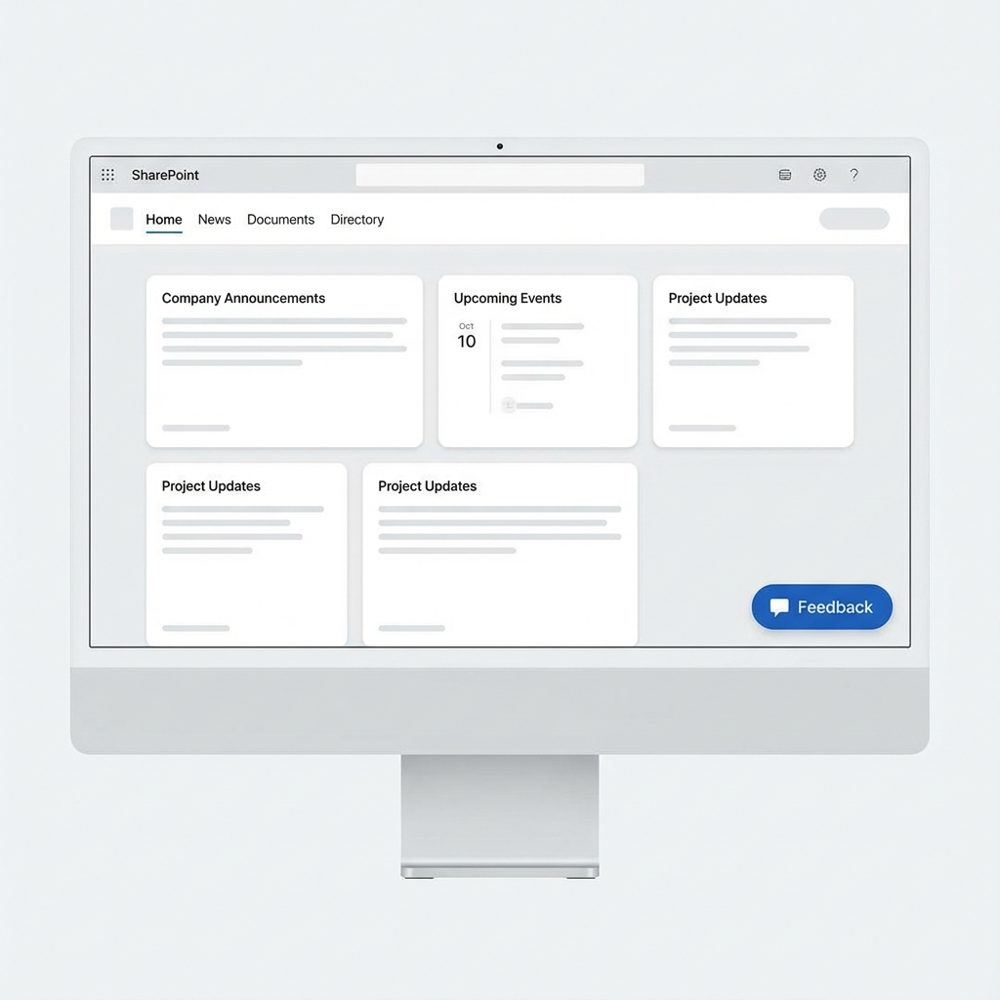
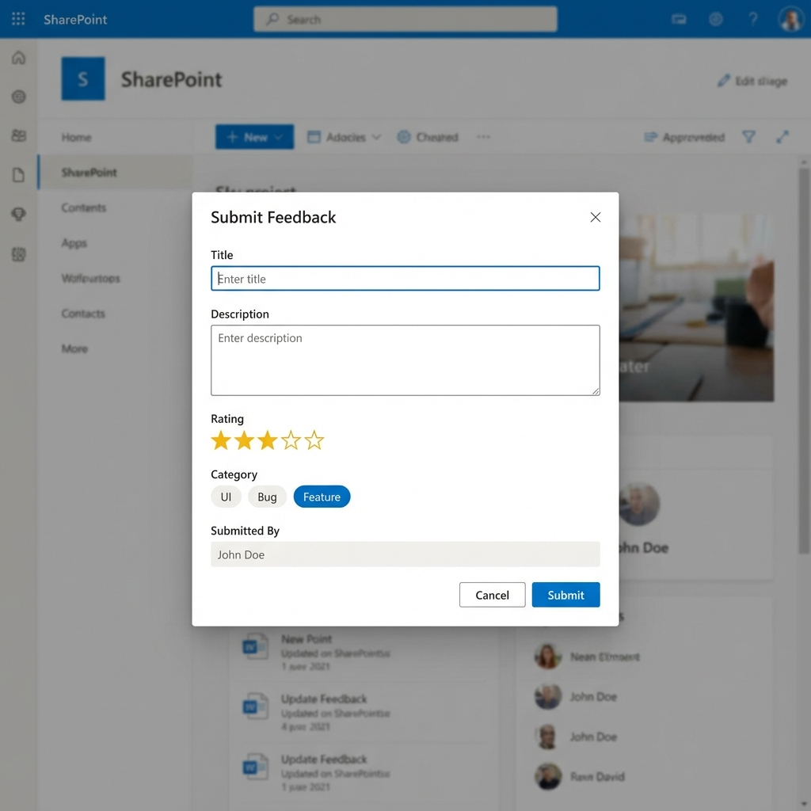

# FloatingFeedback Extension - Setup & Deployment Guide

This guide details how to set up the "Feedback" list, build the solution, and deploy it to your SharePoint environment.

## 1. SharePoint List Setup

The extension automatically looks for a list named **"Feedback"**. You must create this list with the specific columns below before using the extension.

### Step 1: Create the List
1.  Go to your SharePoint Site.
2.  Click **New** > **List**.
3.  Select **Blank list**.
4.  Name it: `Feedback` (Case sensitive).
5.  Click **Create**.

### Step 2: Create Columns
Navigate to **List Settings** or use the **Add column** button to create the following columns:

| Display Name | Type | Settings |
| :--- | :--- | :--- |
| **Title** | Text | *Default column (rename 'Title' if needed, but keep Internal Name 'Title')* |
| **FeedbackText** | Multiple lines of text | Plain text is fine. |
| **Category** | Choice | Add your choices (e.g., UI, Bug, Feature). **Enable "Allow multiple selections"**. |
| **Rating** | Number | Min: 1, Max: 5, Decimals: 0. |
| **SubmittedBy** | Single line of text | Used to store the user's Display Name. |
| **PageName** | Single line of text | Used to store the page title where feedback was given. |

> **Note**: Ensure the *internal names* match if you are creating columns programmatically. If creating via UI, using the names above is sufficient.

---

## 2. Build & Package

To prepare the solution for deployment, run the following commands in your terminal (ensure you are in the project folder):

```bash
# 1. Clean, build, and bundle for production
heft test --clean --production

# 2. Package the solution (Creates the .sppkg file)
heft package-solution --production
```

This will create the package file at:
`sharepoint/solution/floating-feedback.sppkg`

---

## 3. Deployment to App Catalog

You need to upload the package to your Tenant App Catalog or Site Collection App Catalog.

1.  Navigate to your **SharePoint App Catalog**.
    *   *URL usually looks like: `https://<tenant>.sharepoint.com/sites/apps/AppCatalog`*
2.  Click **Upload** (or drag and drop).
3.  Select the `floating-feedback.sppkg` file.
4.  In the "Do you trust..." dialog:
    *   Ensure **"Make this solution available to all sites in the organization"** is **UNCHECKED** (unless you want it everywhere).
    *   Click **Deploy**.

---

## 4. Install on Site

The extension will not appear until the App is "installed" on the specific site you want to use it on.

1.  Go to the SharePoint site where you created the "Feedback" list.
2.  Click the **Gear Icon** (Settings) > **Add an app**.
3.  Find **floating-feedback-client-side-solution** under "From Your Organization".
4.  Click **Add**.
5.  Wait for the app to install (the grayed-out icon will turn colorful).

### 🔄 Important: Updating the App
If you have deployed a new version:
1.  Upload the new `.sppkg` to the App Catalog and replace the old one.
2.  Go to your specific site > **Site Contents**.
3.  Locate the app.
4.  If you see an "Upgrade available" link, click it.
5.  **If you made changes to how the extension loads (like we did recently):**
    *   **Remove** the app (Click three dots > Remove).
    *   **Refresh** the page.
    *   **Add** the app again via "Add an app".
    *   *This ensures the "Feature" that puts the button on the page is re-activated.*

---

---

## 5. Visuals

### Feedback Button


### Feedback Form


## 6. Verification

1.  Navigate to the Home page of your site.
2.  You should see the **Feedback** button (floating pill shape) at the bottom right.
3.  Click it to open the form.
4.  Submit a test entry.
5.  Check your "Feedback" list to see the new item with `PageName`, `Rating`, etc. populated.